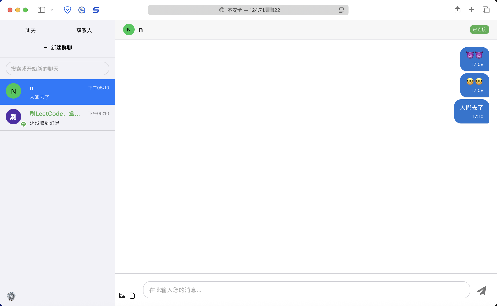

# im-go

一个功能强大的即时通讯应用，支持私聊和群聊功能，基于Go和React构建。


## 项目介绍

im-go是一个完整的即时通讯解决方案，包含服务端和客户端实现。服务端使用Go语言开发，提供高性能的消息处理能力；客户端使用React构建，提供流畅的用户体验。

## 技术栈

### 后端
- Go
- WebSocket
- Redis
- Kafka
- MySQL/PostgreSQL (数据库)

### 前端
- React
- WebSocket
- Context API
- Custom Hooks

## 项目结构

```
im-go
├── bin/                  # 编译后的二进制文件
├── cmd/                  # 应用程序入口点
│   ├── apiserver/        # API服务器
│   └── chatserver/       # 聊天服务器
├── config/               # 配置文件
├── deployments/          # 部署相关文件
├── docs/                 # 文档
├── internal/             # 内部包
│   ├── auth/             # 认证相关
│   ├── config/           # 配置处理
│   ├── handlers/         # HTTP处理器
│   ├── imtypes/          # 类型定义
│   ├── kafka/            # Kafka集成
│   ├── middleware/       # 中间件
│   ├── models/           # 数据模型
│   ├── redis/            # Redis集成
│   ├── services/         # 业务逻辑服务
│   ├── storage/          # 存储接口
│   └── websocket/        # WebSocket处理
├── migrations/           # 数据库迁移文件
└── site/                 # 前端代码
    ├── dist/             # 构建输出目录
    ├── public/           # 静态资源
    └── src/              # 源代码
        ├── components/   # React组件
        ├── contexts/     # React上下文
        ├── hooks/        # 自定义Hook
        └── services/     # 前端服务
```

## 功能特性

- 实时私聊和群聊
- 用户认证和授权
- 联系人管理
- 群组创建和管理
- 消息历史记录和加载更多功能
- 未读消息通知
- 多语言支持（中英文）
- 主题切换
- 自动重连机制
- 系统消息通知

## 安装和运行

### 前提条件
- Go 1.16+
- Node.js 14+
- Redis
- MySQL/PostgreSQL
- Kafka (可选)

### 服务端

```bash
# 克隆仓库
git clone https://github.com/Jw-23/im-go
cd im-go

# 编译并且运行服务器
bash  deployments/start_chatserver_local.sh
bash  deployments/start_apiserver_local.sh 

```

### 客户端

```bash
# 进入前端目录
cd site

# 安装依赖
npm install

# 开发模式运行
npm run dev

# 构建生产版本
npm run build
```

## 开发指南

### 添加新功能

项目采用模块化设计，新功能开发应遵循以下步骤：

1. 在`internal/models`中定义数据模型
2. 在`internal/services`中实现业务逻辑
3. 在`internal/handlers`中添加相应的API处理器
4. 在前端`site/src/services`中添加API调用
5. 在`site/src/components`中实现UI组件

### 代码风格

- Go代码遵循[Go官方代码规范](https://golang.org/doc/effective_go)
- React代码使用函数式组件和Hooks


## 许可证

[MIT](LICENSE) 